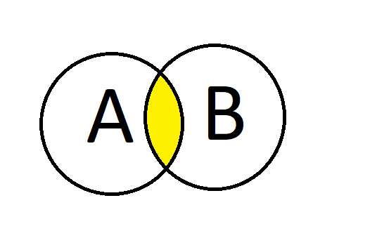
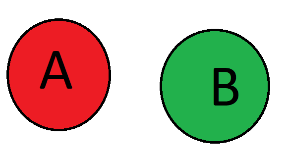

<style>
body {
text-align: justify}
</style>


```{r setup, include=FALSE}
knitr::opts_chunk$set(echo = TRUE)
htmltools::includeCSS("styles.css")
library(htmltools)
tags$head(tags$style(HTML(readLines("styles.css"))))


```

# <span style = "color:#99ff33">Unión de eventos</span>
<span style="font-size: 20px;"> a. Probabilidad de la Unión para eventos ***NO*** mutuamente excluyentes </span>

$P(A  \cup  B) = P(A) + P(B) - P(A \cap B )$

recordar que $P(A \cap B )$ por que si se ve en un diagrama de Venn existe una sección de que ambos ocurran como se ve en la siguiente imagen :

{width=300px height=200px }
<br>
<br>

<span style="font-size: 20px;"> b. Probabilidad de la Unión para eventos mutuamente excluyentes</span>


$P(A  \cup  B) = P(A) + P(B)$

En este caso sería un diagrama del siguiente estilo : 

{width=300px height=200px }

<br>
<br>
<span style="font-size: 20px;"> c. Probabilidad de la Unión para tres eventos mutuamente excluyentes </span>


$P(A \cup B \cup C ) = P(A) + P(B) + P(C) - P(A \cap B) - P(A\cap C ) - P(B \cap C)  + P(A \cap B \cap C)$


<br>
<br>


# <span style = "color:#99ff33"> Probabilidad condicional </span>


$P(A|B) = \frac{P(A \cap B)}{P(B)}$

Esto se puede leer como "Probabilidad de que ocurra A dado que ocurrió B"

Ejemplo 

En un curso de estadística, la probabilidad de que un alumno estudie materia es de un 75%
y la probabilidad de que practique código en R de un 60%. Además se sabe que la probabilidad
de que estudie teoría y practique código es de un 33%. Entonces,¿Cuál es la probabilidad de que
practique código dado que estudio teoría?

```{r, echo=TRUE}
#Consideraremos A como  la probabilidad de que estudie teoría, y B que practique código
#Y se quiere calcular la probabilidad de que ocurra B dado que ocurrio A. Osea
#P(B|A) = P(A interseccion B)/P(A)
p_A = 0.75
p_B = 0.60
aYb = 0.33
pCond = aYb/ p_A
pCond


```


<br>
<br>


# <span style = "color:#99ff33">Intersección de eventos.</span>
## Reglas
<span style="font-size: 20px;"> Regla de la multiplicación </span>

$P(A \cap B) = P(B|A) P(A) = \frac{P(A\cap B)}{P(A)} P(A)$   <br>

o también <br>

$P(A \cap B) = P(A|B) P(B) = \frac{P(A\cap B)}{P(B)} P(B)$


<br>
<br>


# <span style = "color:#99ff33">Independencia.</span>

Para saber si dos eventos serán independientes :

$P(A|B) = P(A)$
<br>
$P(B|A) = P(B)$
<br>
$P(A \cap B) = P(A)P(B)$

<br>
Y para n eventos independientes : 

$P(E_{i1} \cap E_{i2} \cap .... \cap E_{ik}) = P(E_{i1})  \times   P(E_{i2}) \times .... \times P(E_{ik})$


<br>
<br>


# <span style = "color:#99ff33">Introducción al Teoremas de Bayes.</span>

El teorema se utiliza para cuando se tiene información previa y se quiere actualizar con nuevos datos(con datos
haciendo referencia a probabilidades.


$P(A|B) = \frac{P(B|A)P(A)}{P(B)}   \implies  \frac{P(B|A)P(A)}{P(B|A)P(A)+P(B|\overline{A})P(\overline{A}) }$


## Ejemplo 

Se tienen dos industrias multinacionales de tecnologías que producen los teléfono smartphone que son utilizados en todo el mundo.De la primera empresa Sumsang, el 60% de la población mundial utiliza teléfonos creados por ellos, mientras que el otro 40% le pertenece a Pineapple. ***IMPORTANTE : ambas empresas producen teléfonos idénticos, por lo tanto no se puede diferenciar de que empresa es que teléfono.*** Se sabe que la probabilidad que algún teléfono de Sumsang sea defectuoso es de 5%, mientras que el de Pineapple es de un 2%. 


Si me compró un teléfono y sale defectuoso, ¿qué probabilidad hay de que sea de Sumsang?

Para este problema resultará conveniente considerar los siguientes dos hechos : 

A : El teléfono fue fabricado por Sumsang
B : El teléfono es defectuoso

Sabemos que la formula consiste en : 

$P(A|B) = \frac{P(B|A)P(A)}{P(B)}$

y podemos considerar la siguiente información :
```{r, echo=TRUE}
pA = 0.6 # probabilidad de que el telefono fue fabricado por Sumsang
BdadoA = 0.05 # P(B|A) -> probabilidad de que sea defectuoso dado que es de Sumsang
```
Antes de continuar debemos considerar ciertas cosas como por ejemplo  $P(\overline A) = 1 - P(A)$ que sería la probabilidad de que el teléfono sea de pineapple.
Además $P(B|\overline A)$ es lo mismo que la probabilidad de que sea defectuaso dado que lo fabricó Pineapple.

```{r, echo=TRUE}

noA = 0.4 # Probabilidad de que lo fabricará Pineapple
BnoA = 0.02 # Probabilidad de que sea defectuoso dado que lo fabricó Pineapple

```
Ahora podemos reemplazar todos los valores en la formula :

$\frac{P(B|A)P(A)}{P(B|A)P(A)+P(B|\overline{A})P(\overline{A}) }$

```{r, echo=TRUE}

resultado = (0.05 * 0.6)/(0.05*0.6 + 0.02*0.4)

resultado
```
 **Conclusión** :La probabilidad de que si me compró un teléfono y sale defectuoso y sea de Sumsang es de un 79%.
 
 
 <br>
 <br>
 Les facilito una función para que solo identifiquen los párametros a utilizar:
 
```{r, echo=TRUE}


#  Parámetros: 
#  b_A    : P(B|A) -> Para el ejemplo anterior : Que sea defectuoso dado que es de Sumsang 
#  a      : P(A)   -> Para el ejemplo anterior : Que sea de Sumsang
#  notA   : P(~A) o 1 - P(A)  -> Para el ejemplo anterior : Que sea de Pinneapple
#  b_notA : P(B|~A)-> Para el ejemplo anterior : que sea defectuoso dado que es de Pinneaple

bayesFunction <- function(b_A, a, notA, b_notA){
  resultado =b_A*a /(b_A*a+b_notA*notA)
  return(resultado)
}

#Para comprobar que funciona :
resultado <- bayesFunction(BdadoA, pA, noA,BnoA)
resultado


```


<br>
<br>


# <span style = "color:#99ff33"> Bibliografía </span>
  [1] Montgomery, D. C., & Runger, G. C. (2018). Applied statistics and probability for engineers (7th ed.). Wiley.