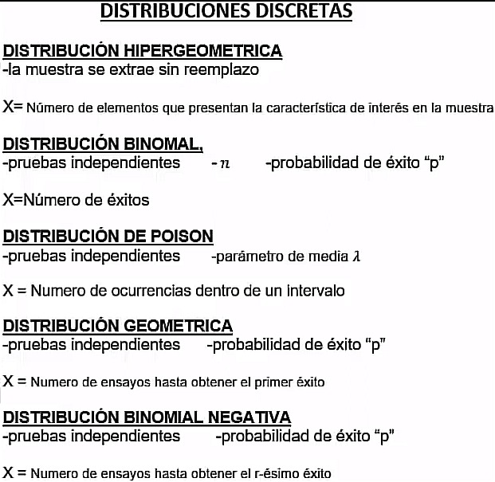

```{r setup, include=FALSE}
knitr::opts_chunk$set(echo = TRUE)
library(ggpubr)
```

# _PUNTOS IMPORTANTES A CONSIDERAR PARA ESTA PARTE DEL CURSO (distribuciones)_


{width=30% height=30%}  {width=30% height=30%}{width=30% height=30%}  


# ***Prefijos en funciones de distribución en R***


## Cuando el prefijo es  ***d*** :

Como por ejemplo, dnorm, dbinom, dchisq, dbern, etc. Para este caso son funciones que se usan para calcular la densidad de la probabilidad de la distribución.

***Lo vamos a querer ocupar para caso en los que se quiere saber $P(X = x)$***

<br>
<br>
<br>

## Cuando el prefijo es  ***p*** :

Como por ejemplo, pnorm, pbinom, pchisq, pbern, etc. Para este caso son funciones que se usan para calcular la probabilidad acumulada de la distribución hasta cierto valor.

***Lo vamos a querer ocupar para caso en los que se quiere saber $P(X \geq x)$ o $P(X\leq x)$ ***

<br>
<br>
<br>

## Cuando el prefijo es  ***q*** :

Como por ejemplo, qnorm, qbinom, qchisq, qbern, etc. Para este caso son funciones que se usan para calcular cuantil correspondiente hasta un nivel de probabilidad de la distribución.

<br>
<br>
<br>

## Cuando el prefijo es  ***r*** :

Como por ejemplo, qnorm, qbinom, qchisq, qbern, etc. Este prefijo de las funciones indica que la función crea valores aleatorios a partir de la distribución.


<br>
<br>
<br>
<br>
<br>

A continuación un resumen de las distribuciones y cuando ocuparlas : 



